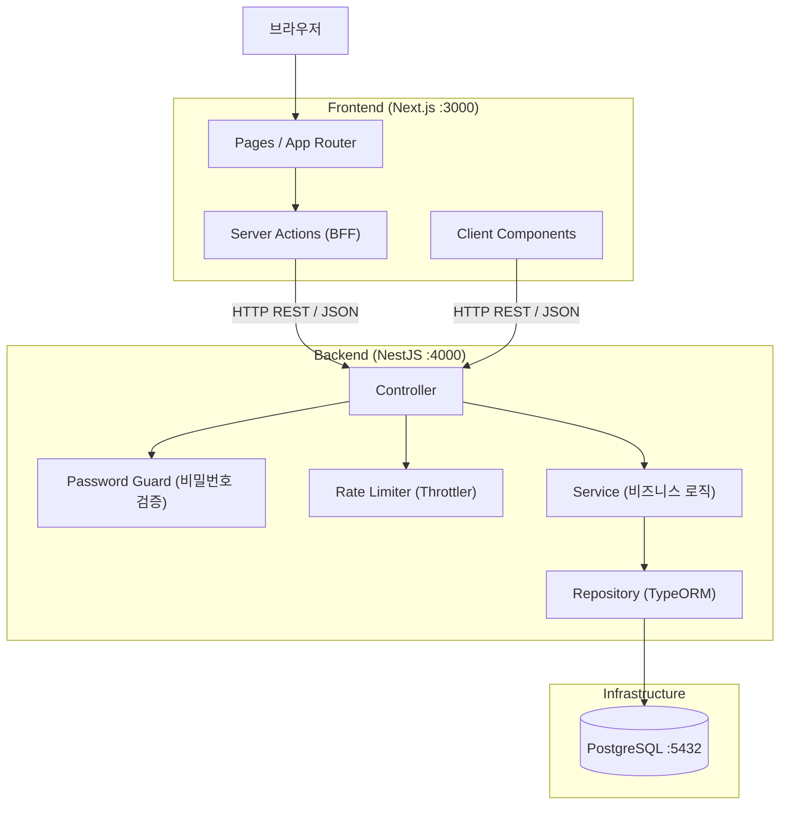

# Architecture: 단순 게시판 서비스

**기준 PRD:** PRD.md v1.0  
**작성일:** 2026-04-29

---

## 1. 시스템 개요

회원가입 없이 닉네임·비밀번호만으로 게시글을 작성·관리할 수 있는 단순 게시판 서비스다.

**핵심 아키텍처 결정:**

- 프론트엔드와 백엔드를 분리해 각 레이어를 독립적으로 배포·스케일할 수 있게 한다.
- 모든 비즈니스 로직(비밀번호 검증, 스팸 방지, 소프트 삭제)은 백엔드(NestJS)에 집중한다. 프론트엔드는 렌더링과 UX만 담당한다.
- 데이터 무결성과 ACID 트랜잭션이 핵심이므로 관계형 데이터베이스(PostgreSQL)를 사용한다.

---

## 2. 레이어 구조 및 역할 분담

| 레이어 | 기술 | 책임 |
|---|---|---|
| 프론트엔드 | Next.js 15 (App Router) | 화면 렌더링, 사용자 인터랙션, Server Actions를 통한 BFF 역할 |
| 백엔드 | NestJS 11 | REST API 제공, 비즈니스 로직, 비밀번호 검증, 스팸 방지 |
| 데이터 접근 | TypeORM 0.3 | 도메인 모델 ↔ DB 매핑, 쿼리 추상화 |
| 데이터 저장 | PostgreSQL 16 | 영속성, ACID 트랜잭션, 관계형 데이터 무결성 |
| 인프라 | Docker Compose | 로컬/개발 환경 전체 스택 단일 명령 구동 |

---

## 3. 시스템 구성도

---

## 4. 컴포넌트 간 통신 방식

| 구간 | 방식 | 설계 의도 |
|---|---|---|
| 브라우저 ↔ Next.js | HTTP | SSR로 초기 렌더링 속도 확보 |
| Next.js Server Actions ↔ NestJS | HTTP REST / JSON | BFF 레이어로 동작해 API 엔드포인트를 브라우저에 직접 노출하지 않는다 |
| Client Components ↔ NestJS | HTTP REST / JSON | 검색·페이지 이동 등 동적 인터랙션에 한정 |
| NestJS ↔ PostgreSQL | TCP (TypeORM 커넥션 풀) | 단일 DB 인스턴스 대상, 커넥션 풀로 동시성 관리 |

**설계 원칙:** 외부에 노출되는 API는 NestJS 컨트롤러 한 곳에서만 제공한다. Server Actions는 이 API를 호출하는 프록시다. 비즈니스 판단(비밀번호 일치 여부, 삭제 권한)은 반드시 백엔드에서 수행한다.

---

## 5. 데이터 저장 전략

**PostgreSQL을 선택한 이유:**

이 서비스의 데이터는 게시글-댓글 간 FK 관계, 조회수 원자적 증가, 소프트 삭제 플래그 관리처럼 **관계형 구조와 ACID 트랜잭션**이 필수다. 이를 가장 안정적으로 보장하는 **관계형 데이터베이스(PostgreSQL)**를 사용한다.

| 전략 | 내용 |
|---|---|
| 단일 인스턴스 | v1.0 규모(동시 100명)에서 읽기/쓰기 분리나 캐싱 레이어는 과설계다 |
| 소프트 삭제 | 게시글·댓글은 물리 삭제 대신 `is_deleted` 플래그로 논리 삭제한다. 데이터 복구 가능성을 유지하면서 쿼리 복잡도를 낮춘다 |
| 키워드 검색 | v1.0은 LIKE 검색으로 처리한다. 성능 문제 발생 시 PostgreSQL 내장 FTS(Full Text Search)로 단계적 전환한다 |

---

## 6. 핵심 품질 속성 달성 전략

### 성능 (목록·상세 ≤ 1초, p95)

- 목록 쿼리에 페이지네이션(20건)을 강제해 풀 스캔을 방지한다.
- 조회수 증가는 별도 UPDATE 쿼리로 원자적으로 처리해 동시 요청 시 중복을 방지한다.
- SSR(Next.js)로 초기 페이지 로드를 빠르게 처리한다.

### 보안 (비밀번호 보호)

- 비밀번호는 백엔드에서 bcrypt로 해시한 뒤 저장한다. 평문은 어떤 레이어에서도 영속하지 않는다.
- 수정·삭제 요청은 NestJS Password Guard에서 해시 비교 후 통과 여부를 결정한다. 프론트엔드 판단에 의존하지 않는다.

### 스팸 방지

- NestJS Throttler가 동일 IP 분당 글쓰기 5회를 제한한다. Controller 진입 직후 실행되며, 이 검사를 우회하는 경로는 없다.

### 확장성

- 프론트·백엔드 분리로 트래픽 증가 시 각 레이어를 독립적으로 스케일아웃할 수 있다.
- v1.0은 단일 인스턴스로 동시 100명을 커버하는 것을 목표로 한다.

---

## 7. 기술 스택 제약 사항

| 기술 | 선택 근거 |
|---|---|
| TypeScript (전 레이어) | 프론트-백 간 타입 공유로 인터페이스 불일치를 컴파일 타임에 잡는다 |
| Next.js App Router | Server Actions 기반 BFF 패턴으로 내부 API URL을 클라이언트에 노출하지 않는다 |
| NestJS | 모듈·DI 구조로 Guard, Interceptor, Throttler를 선언적으로 적용한다 |
| Docker Compose | 로컬 환경에서 DB 포함 전체 스택을 단일 명령으로 구동해 환경 차이를 제거한다 |

---

## 8. 범위 외 아키텍처 결정 (v1.0)

다음은 이번 버전에서 의도적으로 포함하지 않은 아키텍처 요소다:

| 항목 | 제외 이유 |
|---|---|
| 인증 시스템 (JWT/세션) | 회원가입 기능 없음 |
| 캐싱 레이어 (Redis) | 현재 트래픽 규모에서 과설계 |
| 메시지 큐 (Kafka/RabbitMQ) | 비동기 처리가 필요한 기능 없음 |
| CDN / 파일 스토리지 | 파일·이미지 첨부 미지원 |
| 읽기 복제본 (Read Replica) | 단일 DB 인스턴스로 충분한 규모 |
