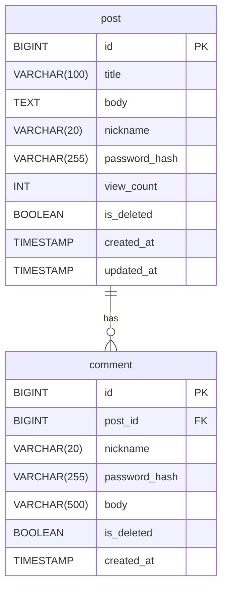

# ERD: 단순 게시판 서비스

**기준 PRD:** PRD.md v1.0  
**작성일:** 2026-04-29

---

---

## 테이블 명세

### post

| 컬럼 | 타입 | 제약 | 설명 |
|---|---|---|---|
| id | BIGINT | PK, AUTO_INCREMENT | 게시글 식별자 |
| title | VARCHAR(100) | NOT NULL | 제목 (1~100자) |
| body | TEXT | NOT NULL | 본문 (1~5,000자) |
| nickname | VARCHAR(20) | NOT NULL | 작성자 닉네임 (2~20자) |
| password_hash | VARCHAR(255) | NOT NULL | bcrypt 해시된 비밀번호 |
| view_count | INT | NOT NULL, DEFAULT 0 | 조회수 |
| is_deleted | BOOLEAN | NOT NULL, DEFAULT false | 소프트 삭제 플래그 |
| created_at | TIMESTAMP | NOT NULL, DEFAULT NOW() | 작성 시각 |
| updated_at | TIMESTAMP | NOT NULL, DEFAULT NOW() | 수정 시각 |

### comment

| 컬럼 | 타입 | 제약 | 설명 |
|---|---|---|---|
| id | BIGINT | PK, AUTO_INCREMENT | 댓글 식별자 |
| post_id | BIGINT | NOT NULL, FK → post.id | 부모 게시글 |
| nickname | VARCHAR(20) | NOT NULL | 작성자 닉네임 (2~20자) |
| password_hash | VARCHAR(255) | NOT NULL | bcrypt 해시된 비밀번호 |
| body | VARCHAR(500) | NOT NULL | 댓글 내용 (1~500자) |
| is_deleted | BOOLEAN | NOT NULL, DEFAULT false | 소프트 삭제 플래그 |
| created_at | TIMESTAMP | NOT NULL, DEFAULT NOW() | 작성 시각 |

---

## 인덱스

| 테이블 | 인덱스 | 컬럼 | 목적 |
|---|---|---|---|
| post | idx_post_created_at | created_at DESC | 최신순 목록 조회 |
| post | idx_post_is_deleted | is_deleted | 소프트 삭제 필터 |
| comment | idx_comment_post_id | post_id | 게시글별 댓글 조회 |
| comment | idx_comment_is_deleted | is_deleted | 소프트 삭제 필터 |

> **키워드 검색 인덱스 없음:** v1.0은 LIKE 검색으로 처리한다 (Architecture 결정). 동시 100명 규모에서 풀 스캔이 허용 가능하다. 트래픽 증가 시 PostgreSQL GIN 인덱스(pg_trgm)로 전환한다.

---

## 관계

| 관계 | 설명 |
|---|---|
| post 1 : N comment | 하나의 게시글은 댓글을 0개 이상 가질 수 있다 |

---

## 설계 결정 사항

- **회원 테이블 없음** — 닉네임 + 비밀번호를 각 게시글·댓글에 직접 저장 (PRD 인증 없는 게시판 요건)
- **소프트 삭제** — `is_deleted` 플래그로 처리, 데이터 복구 가능성 확보
- **비밀번호 평문 미저장** — bcrypt 해시만 저장, 원본 비교는 bcrypt.compare 사용
- **comment.updated_at 미포함** — PRD에서 댓글 수정 기능이 v1.0 범위 외
