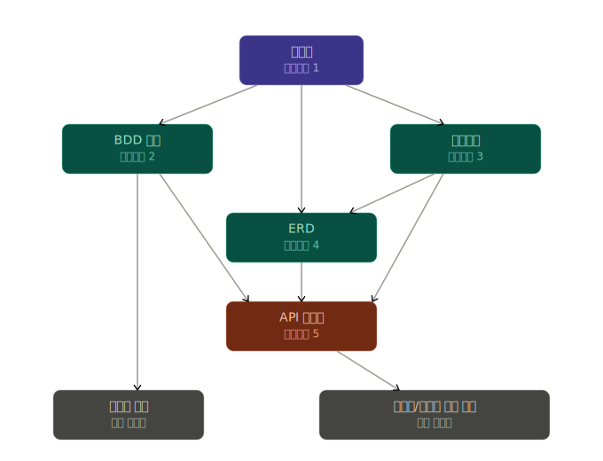

# BDD 기반 설계 문서 실험

코드를 한 줄 작성하기 전에 **산출물 간 의존성을 정의하고, BDD 시나리오로 기획의 구멍을 찾는** 과정을 검증한 실험 프로젝트.  
단순 게시판은 예제 도메인일 뿐이다.

---

## 산출물 의존 관계

산출물마다 명확한 Input과 Output이 있다. 이 순서를 지키면 하위 문서가 상위 문서의 결정을 일관되게 반영할 수 있다.



| 우선순위 | 산출물 | Input | Output |
|---|---|---|---|
| 1 | [기획서 (PRD)](docs/PRD.md) | - | 모든 산출물 |
| 2 | [BDD 문서](docs/BDD.md) | 기획서 | API 명세서, 테스트 코드 |
| 3 | [아키텍처](docs/ARCHITECTURE.md) | 기획서 | ERD, API 명세서 |
| 4 | [ERD](docs/ERD.md) | 기획서, 아키텍처 | API 명세서 |
| 5 | [API 명세서](docs/API.md) | BDD, ERD, 아키텍처 | 프론트/백엔드 구현 코드 |

---

## BDD가 기획 구멍을 찾는다

BDD 시나리오는 "구체적인 입력 → 구체적인 출력"을 강제한다.  
이 과정에서 추상적인 기획 문장이 감추고 있던 결함이 드러난다.

이 프로젝트에서 **코드 한 줄 없이** BDD 시나리오 작성만으로 기획 구멍 10개를 발견했다.

| 구멍 | 발견 경위 |
|---|---|
| 삭제된 글과 없는 글, 둘 다 404인데 프론트가 메시지를 어떻게 구분? | 백엔드 Then과 프론트 Then을 같이 쓰다 충돌 발견 |
| `/posts/:id/edit` 직접 접근 시 비밀번호 검증 우회 가능 | 비정상 플로우 시나리오 작성 시도 중 발견 |
| 수정 가능한 필드가 제목뿐인지 본문도 포함인지 미명시 | PATCH body 작성 중 발견 |
| 게시글 삭제 시 댓글 처리 정책 없음 | Feature 간 상호작용 시나리오 작성 중 발견 |
| 빈 검색어 요청 시 동작 미정의 | 엣지 케이스 Given 작성 중 발견 |
| 검색 결과 페이지네이션이 PRD에만 있고 BDD에 없음 | 커버리지 점검 중 발견 |
| Rate Limit "글쓰기" 범위에 댓글 포함 여부 불명확 | 스팸 방지 시나리오 범위 정의 중 발견 |
| 댓글 정렬 순서 미명시 | Background 작성 중 발견 |
| 게시글 0건 빈 상태 화면 미정의 | Given 조건 설정 중 발견 |
| 비밀번호 모달 취소 동작 미정의 | 부정 경로 시나리오 작성 중 발견 |

> 전체 발견 과정과 결정 근거 → [BDD-EFFECT.md](docs/BDD-EFFECT.md)

---

## 문서

| 문서 | 설명 |
|---|---|
| [PRD](docs/PRD.md) | 사용자 스토리, 기능 명세, 비기능 요구사항 |
| [Architecture](docs/ARCHITECTURE.md) | 레이어 구조, 품질 속성, 기술 선택 근거 |
| [ERD](docs/ERD.md) | 테이블 설계, 인덱스, 관계 |
| [BDD](docs/BDD.md) | 프론트엔드(Playwright) + 백엔드(Supertest) 시나리오 |
| [API](docs/API.md) | 엔드포인트 7개, 요청/응답 스키마, 에러 코드 |
| [BDD-EFFECT](docs/BDD-EFFECT.md) | BDD 효과성 케이스 스터디 |

---

## 인프라 실행

```bash
cp .env.example .env
docker compose up -d   # PostgreSQL :5432
```
